---

layout: default

style: |

    #Cover h2 {
        margin:30px 0 0;
        color:#FFF;
        text-align:center;
        font-size:70px;
        }
    #Cover p {
        margin:10px 0 0;
        text-align:center;
        color:#FFF;
        font-style:italic;
        font-size:30px;
        }
        #Cover p a {
            color:#FFF;
            }
    #Picture h2 {
        color:#FFF;
        }
    #SeeMore h2 {
        font-size:100px
        }
    #SeeMore img {
        width:0.72em;
        height:0.72em;
        }
---

# Системы тест-менеджмента {#Cover}

*Денис Мордвинов.*

*Тот самый, кто надоел всем разработчикам.*

*Rosberry*

<!-- photo by John Carey, fiftyfootshadows.net -->

## Intro

Test rails разрабатывает и поддерживает компания Gurock Software.
И он является на сегодняшний день неоспоримым лидером на рынке систем тест-менеджмента. Просто взгляните, какие компании используют этот инструмент 
у себя.

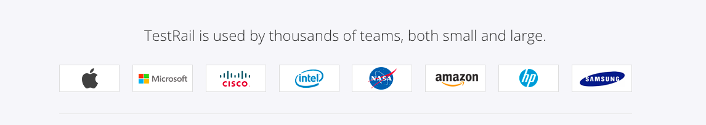

##  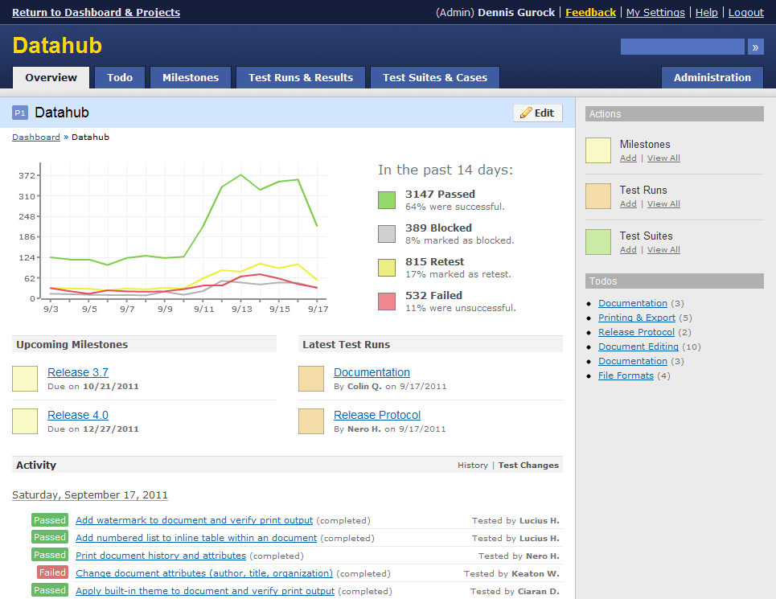
{:.cover .h .w}

## Features

1. Полноценная интеграция с Jira.(возможность создавать тикеты 
   прямо из test rails)
2. Генерация подробных репортов.(по результатам тестирования, так и по выбранным критериям(по зафейленным тест-кейсам например) 
3. Нативный интерфейс.(все просто и понятно без всяких туториалов)
4. Все данные, логи,результаты хранятся в облаке.(голова не болит об обслуживании системы)

## Зачем?

Однажды мы дошли до момента, когда стало очень трудно держать наборы тест-кейсов в
голове...Для нескольких проектов...Одновременно...

## Как выглядит заведение тест-кейсов?

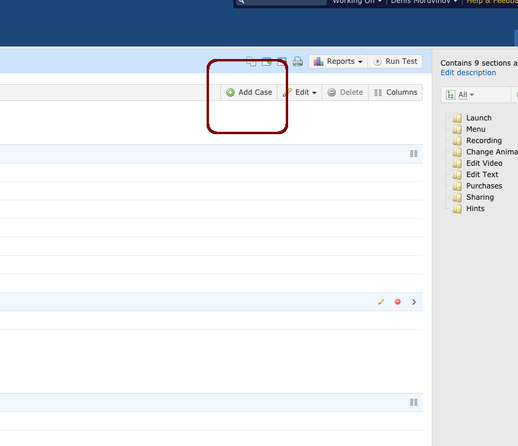
{:.cover .w .h}

## Что нужно чтобы подготовить тестовый прогон?

1. Завести необходимое количество тест-кейсов
2. Перейти на вкладку Test runs and Test Results
3. Нажать на кнопку Add test run
4. Сформировать набор тест-кейсов, отправляющихся в этот прогон
5. Нажать Add Test Run кнопку

## Подготовка тестового прогона

1. Завести необходимое количество тест-кейсов

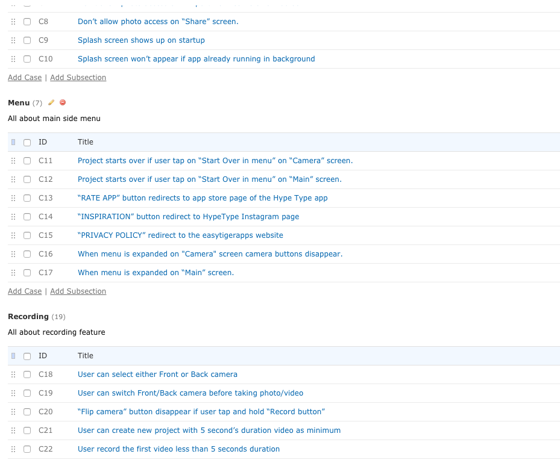
{:.cover .w .h}

## Подготовка тестового прогона

2. Перейти на вкладку Test runs and Test Results

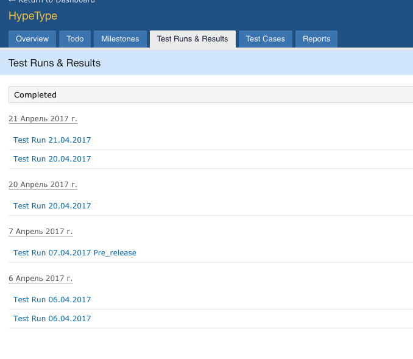
<!-- photo by John Carey, fiftyfootshadows.net -->

## Подготовка тестового прогона

3. Нажать на кнопку Add test run

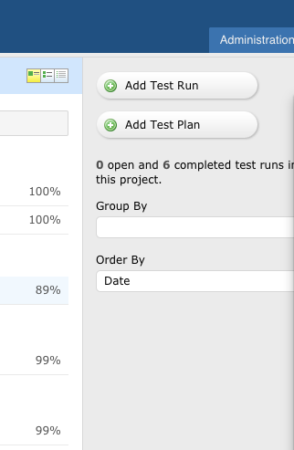
<!-- photo by John Carey, fiftyfootshadows.net -->

## Подготовка тестового прогона

4. Сформировать набор тест-кейсов, отправляющихся в этот прогон

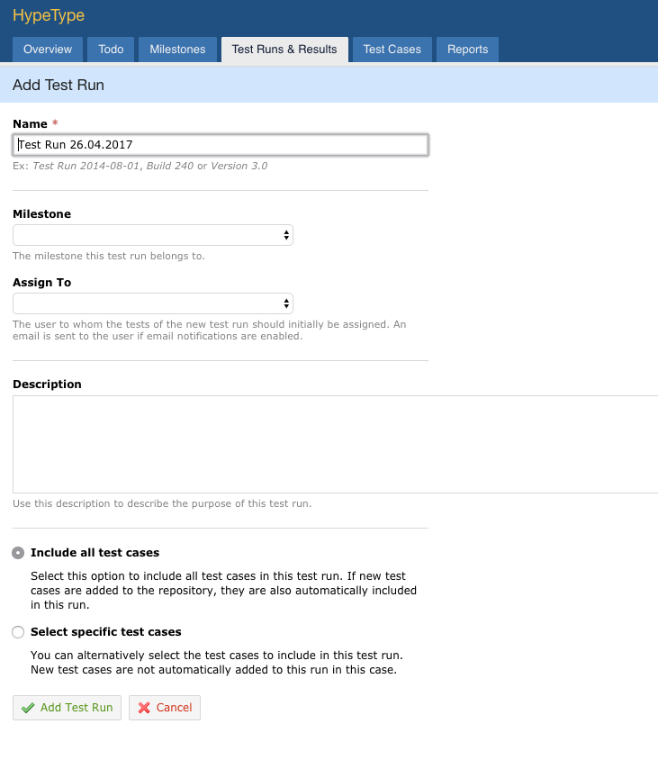
<!-- photo by John Carey, fiftyfootshadows.net -->

## Просмотр метрики и анализ итогов

5. Провести тестовый прогон и снять метрику

{:.cover .w .h}

## **Абсолютно никаких проблем! Все просто и понятно!**

## 
{:.cover .h}

## Тест кейс не прошел - нажал кнопку и создал тикет в жиру

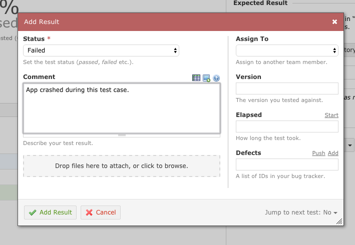
<!-- photo by John Carey, fiftyfootshadows.net -->
{:.cover .h}

## Сам тикет в нашей жире

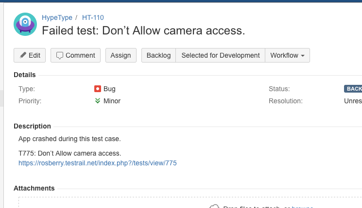

## Также можно подключить плагин к Жире
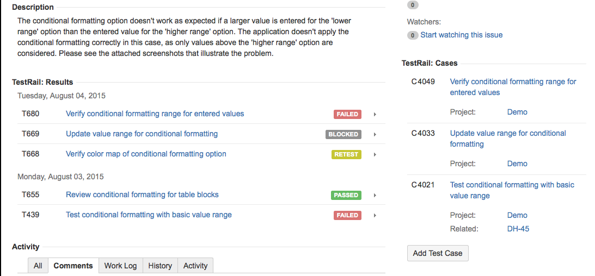

## И Наконец есть отрытый API для интеграции с фреймворками автотестирования

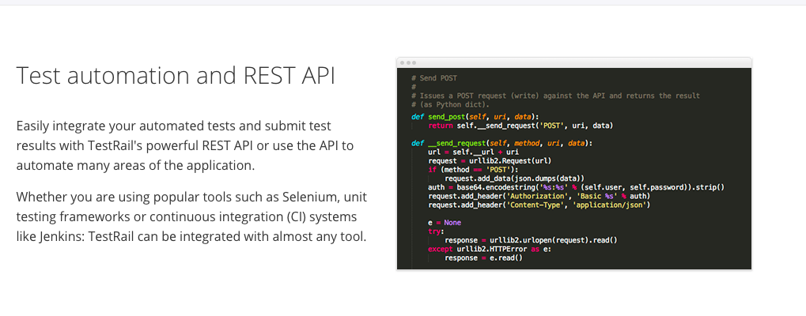

## Выводы

Плюсы

Test rails позволяет быстро и максимально эффективно организовать 
тестирование без особых усилий. Все работает из коробки и 
нативно удобно. Когда мы тестирование Test rails то не трогали ни одну из 
дефолтных настроек. Все максимально удобно и практично.Это плюсы. 

## Выводы

Минусы

-Практически никакая интеграция с автотестированием. Та Api, которая есть
 предлагает самому интегрироваться с нужным тебе фреймворком.(то есть все нужно делать руками)

-Платность(и стоит дорого)

## **Спасибо**

## 
{:.cover .h}

